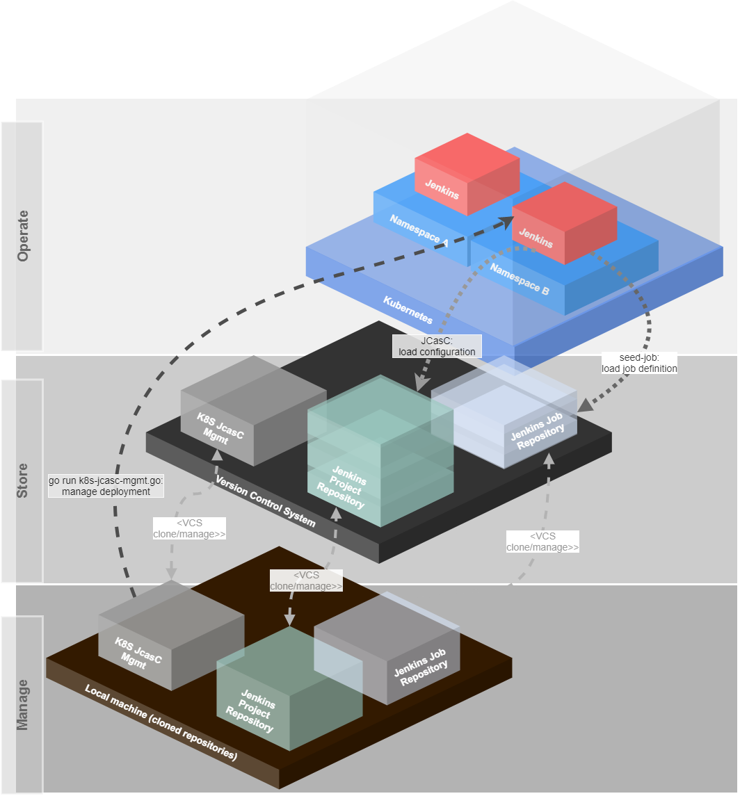
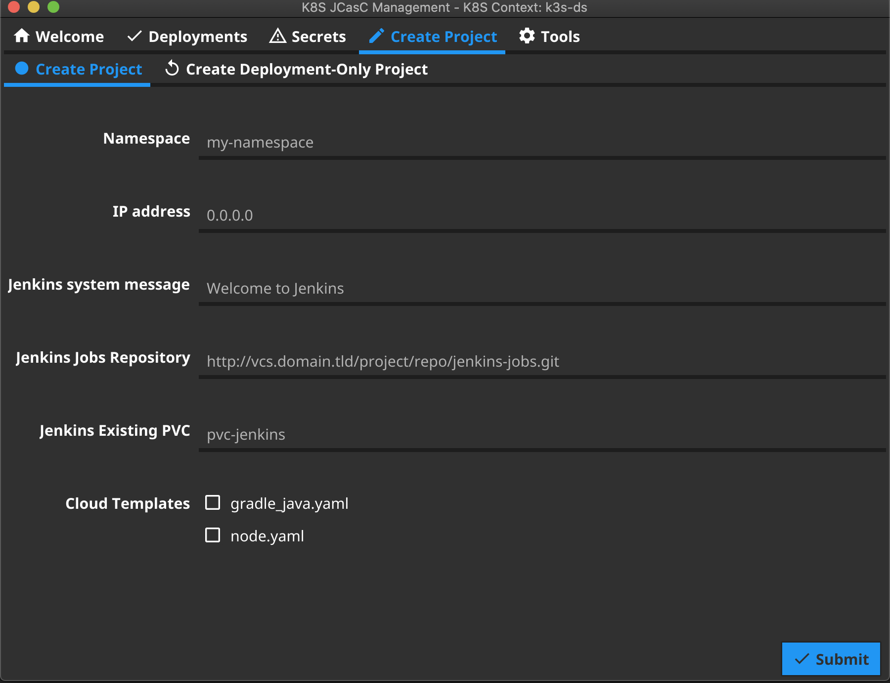

# K8S-JCasC-Management (Go version)

# Table of content #

* [Kubernetes Jenkins as Code management](#kubernetes-jenkins-as-code-management)
  * [Prerequisites](#prerequisites)
* [Basic concept](#basic-concept)
  * [Advantages](#advantages)
* [Build slaves](#build-slaves)
* [Configuration](#configuration)
  * [Configure alternative configuration with overlays](#configure-alternative-configuration-with-overlays)
* [How to use](#how-to-use)
  * [Build hints](#build-hints)
  * [Dry-Run and Logging](#dry-run-and-logging)
  * [Debugging](#debugging)
  * [Templates](#templates)
    * [Deployment-only Namespaces](#deployment-only-namespaces)
    * [Sub-Templates (cloud-templates)](#sub-templates-cloud-templates)
* [Execution of Scripts](#execution-of-scripts)
* [IP Management](#ip-management)
* [Screenshots](#screenshots)
  * [Deployment](#deployment)
  * [Create Project](#create-project)
* [Additional tools](#additional-tools)
  * [k8sfullconfigexport](#k8sfullconfigexport)
* [Helpful links](#helpful-links)

# Kubernetes Jenkins as Code management #

This project offers a template for managing Jenkins instances on Kubernetes with a JobDSL and Jenkins Configuration as Code (JcasC).

To simplify the installation and the project settings, it has a small helper tool `k8s-jcasc-mgmt.go`, which can be used in wizard mode or via arguments to
* create new projects for Jenkins administration
* manage secrets
    * encrypt/decrypt secrets for secure commit to a VCS (version control system)
    * apply secrets to Kubernetes
        * for each project while installation or as an update (`applySecrets`)
        * for all known namespaces, that are configured in the `ip_config.cnf` file (applySecretsToAll)
    * store secrets globally for easy administration
    * store secrets per project for more security
* manage the Jenkins instances for a namespace with the project configuration
    * install
        * create namespace if it does not exist
        * install Jenkins
        * install nginx-ingress-controller per namespace (if configured)
        * install loadbalancer and ingress for Jenkins
    * uninstall
        * uninstall Jenkins installation
        * uninstall nginx-ingress-controller per namespace (if configured)
        * uninstall loadbalancer and ingress for Jenkins (other ingress routes will not be changed)
    * upgrade
* version check to see a message in the console if a new version is available

*If you want to use existing persistent volume claims, then you have to create a persistent volume before you install the application.*

*The password for the preconfigured secrets file is `admin`. There is no valid data inside this file! Please change it for your own project!*

As default the system uses encrypted passwords instead of using the password from the `jenkins_helm_values.yaml`.
The default users and passwords are:

- administrator
  - User: admin
  - Pass: admin
  - permissions: all
- project user
  - User: project-user
  - Pass: project
  - permissions: read all and execute build

This can be changed on the `jcasc_config.yaml` file under the `jenkins.securityRealm` section.

## Prerequisites ##

To use this tool, you need to have the following tools installed:

* golang >= 1.14
* shell (sh/bash for scripts support)
* for encryption:
    * gpg
* [kubectl](https://kubernetes.io/docs/tasks/tools/install-kubectl/)
* [helm 3](https://helm.sh/)

# Basic concept #



* A namespace contains one Jenkins instance.
* The namespace is more or less equal to a k8s-mgmt project
    * Projects are stored in a separate repository in a VCS
    * The project contains
        * the Jenkins Helm Chart values.yaml overwrites
        * one JCasC file
* The Jenkins for each namespace will be deployed via k8s-mgmt from the cloned Git repository
* Jenkins loads its main configuration from the project repository (and only from this, which means you can play around and reload configuration directly from the remote URL)
* This main configuration also contains a very simple `seed-job`, which does a scm checkout of a Groovy script to manage jobs and a repository, which contains the job definition.
    * you can use the [jenkins-jobdsl-remote](https://github.com/Ragin-LundF/jenkins-jobdsl-remote) script as such an seed-job manager.

## Advantages ##
By having all things stored in VCS repositories, which are normally backed up, it is possible to recreate every instance in no-time.
It is impossible to misconfigure a Jenkins instance, because the configuration can be reloaded from this remote repository and all configurations are completely versioned.

Also, every develops maybe can have admin access to play around with the Jenkins, because they can not destroy the system permanently with the beloved "I have nothing done..." statement. 

If the K8S cluster or server crashes, it is possible to redeploy everything as it was in minutes, because also the job definition is stored in a VCS repository.

# Build slaves #
The pre-defined slave-containers will not work directly.
Every build slave container needs to set up the jenkins home work directory and jenkins user/group with `uid`/`gid` `1000`.

Also, the build slaves did not need to have any jenkins agent or something else. Only the user/group and the workdir is needed.

To resolve the problem, that build containers directly shut down, simply add an entrypoint with a `tail -f /dev/null`.

You can also create a Jenkins build slave base container and build your own build tools container on top of it.

Example of a jenkins-build-slave-base-container:

```Dockerfile
FROM alpine:3.10

ARG VERSION=1.0.0
LABEL Description="Jenkins Build Slave Base Container" Vendor="K8S_MGMT" Version="${VERSION}"

###### GLIBC for alpine image
# GLIBC-ENVIROMENT
ENV GLIBC_LANG=en_US
ENV GLIBC_VERSION=2.28-r0
ENV LANG=${GLIBC_LANG}.UTF-8
ENV LANGUAGE=${GLIBC_LANG}.UTF-8

# install_actions base packages, that will be used in most containers
RUN apk update && apk -U upgrade -a && \
    apk add --no-cache xz tar zip unzip sudo curl wget bash git git-lfs procps ca-certificates

# GET GLIBC FROM SGERRAND: https://github.com/sgerrand/alpine-pkg-glibc
RUN wget -O /etc/apk/keys/sgerrand.rsa.pub https://alpine-pkgs.sgerrand.com/sgerrand.rsa.pub && \
    wget https://github.com/sgerrand/alpine-pkg-glibc/releases/download/${GLIBC_VERSION}/glibc-${GLIBC_VERSION}.apk && \
    wget https://github.com/sgerrand/alpine-pkg-glibc/releases/download/${GLIBC_VERSION}/glibc-bin-${GLIBC_VERSION}.apk && \
    wget https://github.com/sgerrand/alpine-pkg-glibc/releases/download/${GLIBC_VERSION}/glibc-i18n-${GLIBC_VERSION}.apk && \
    apk add --no-cache glibc-${GLIBC_VERSION}.apk glibc-bin-${GLIBC_VERSION}.apk glibc-i18n-${GLIBC_VERSION}.apk && \
    rm -f /etc/apk/keys/sgerrand.* && \
    echo "export GLIBC_LANG=${LANG}" > /etc/profile.d/locale.sh && \
    echo "LANG=${LANG}" >> /etc/environment && \
    /usr/glibc-compat/bin/localedef -i ${GLIBC_LANG} -f UTF-8 ${GLIBC_LANG}.UTF-8 && \
    rm *.apk && \
    echo "Installing additional packages... done"

###### Jenkins setup
# Required Jenkins user/group/gid/uid/workdir
ARG user=jenkins
ARG group=jenkins
ARG uid=1000
ARG gid=1000
ARG AGENT_WORKDIR=/home/${user}/agent

# create jenkins user
RUN addgroup -g ${gid} ${group} && adduser -h /home/${user} -u ${uid} -G ${group} -D ${user}

# create directories and permissions
RUN mkdir /home/${user}/.jenkins && mkdir -p ${AGENT_WORKDIR}

VOLUME /home/${user}/.jenkins
VOLUME ${AGENT_WORKDIR}

WORKDIR /home/${user}

# let the container tail /dev/null, that Kubernetes will not shut down the container directly after startup.
ENTRYPOINT ["tail", "-f", "/dev/null"]
```

A build-slave container for docker can look then like this:

```Dockerfile
FROM jenkins-slave-base
ARG VERSION=1.0.0
LABEL Description="Docker container with Docker for executing docker build and docker push" Vendor="K8S_MGMT" Version="${VERSION}"

# Installing docker
RUN apk update && apk -U upgrade -a && \
    apk add --no-cache docker

# adding jenkins user to docker group
RUN addgroup -S ${user} docker
```

# Configuration #

The system has a basic configuration file to pre-configure some global settings.
This file is located under [config/k8s_jcasc_mgmt.cnf](config/k8s_jcasc_mgmt.cnf).

It is recommended to change the `PROJECTS_BASE_DIRECTORY` to a directory outside of this project.
The `createproject` command will create new projects as subfolders of this directory.
All files and directories under the `PROJECTS_BASE_DIRECTORY' should be passed to a git repository which is backed up.

Then your existing Jenkins projects can be fully recovered from this repository.

## Configure alternative configuration with overlays ##

To use this repository "as-it-is", it is possible to create a `config/k8s_jcasc_custom.cnf` file.

This file can contain the following configuration:

```bash
# Define path to alternative configuration file
K8S_MGMT_ALTERNATIVE_CONFIG_FILE=/my/path/to/my.config

# Defines the basepath of the project to use relative pathes
# inside of the configuration of the project
K8S_MGMT_BASE_PATH=/my/path/to
```

The script checks, if this file exists.
If this is the case, it loads this configuration and checks the argument for the path of the alternative config file.

This means, that the `K8S_MGMT_ALTERNATIVE_CONFIG_FILE` key can define, where the alternative of the `k8s_jcasc_mgmt.cnf` is located.
In the `.gitignore` file, this file is set to ignore, to prevent a commit.

It is also possible to use any other variable from the `k8s_jcasc_mgmt.cnf` file here. In most cases this file should only link to the target configuration and configure the base path.
Any other configuration should be versioned inside of the project directory.

For base paths like templates, the system searches first for the configured base path and if the directory does not exist, it tries to find the directory in the local (`./`) directory.
With this mechanism it is not required to copy for example also the templates into the project directory if they are ok.


# How to use #

The simplest way is to call the script without arguments. Everything else will be asked by the script.

*Hint: Before you install the Jenkins, you have to commit the files of your project directory and to ensure, that the `jasc_config.yaml` file is readable for Jenkins (public)*

```bash
go run k8s-jcasc-mgmt.go
```

You can also add one of the following flags:

| Flag | Description | Example |
| --- | --- | --- |
| -basepath=<basepath> | Set the basepath where the config and templates can be found. The default is the current directory. This can be used to re-use the configuration from the `bash` version. | `-basepath="/project/k8s-management/"` |
| -logfile=<path/to/logfile> | Set the path/name to a logfile. If this flag was set, the system logs into this file. | `-logfile="/var/log/k8smgmt.log"` |
| -logencoding=<encoding> | Set log encoding of the logger (`zap`). Default is `json`. Possible values are: `json` or `console` | `-logencoding=console` |
| -server=<true|false> | *Experimental*. Starts the system as a server. Currently it has not enough functions to talk about... | `-server=true` |

## Build hints ##

This was realized with the [fyne](https://fyne.io/) framework.
If you have trouble to compile the project, please visit the [fyne developer](https://developer.fyne.io/started/) site first to check the prerequisites.
On Windows, it is recommended to install [TDM-GCC - tdm-gcc.tdragon.net](https://tdm-gcc.tdragon.net).

If you have trouble, you can also exchange the `!ignore` and `ignore` in first line comment at the `/app/app_cli.go` and `/app/app_gui.go` file.
Golang will then use the `app_cli.go` file to compile and ignores the GUI implementation completely.


## Dry-Run and Logging ##

For dry-run with logging it is highly recommended, to use the following option:

```bash
go run k8s-jcasc-mgmt.go -logfile=debug.log -logencoding=console -dry-run
```
This logs the output in console format, which makes it much more readable. With the `-dry-run` option it renders only the Helm Charts and outputs them into the logfile.

It is also a good idea to use the `-logfile=<file>` and `-logencoding=console` arguments if there are problems.

## Debugging ##

To debug this application in JetBrains GoLand (will maybe work also in IntelliJ, but was not tested), you have to open the `Actions` and to choose `Registry...`.
There is a point called `go.run.processes.with.tty`, which should be activated. This is relevant because of the UI elements.

`Actions` can be found with:
- Mac: `Command` + `Shift` + `A`
- Windows: `Ctrl` + `Shift` + `A`

## Templates ##

At the `templates` directory contains the following:
- `cloud-templates` -> support for subsets for Jenkins Cloud templates
- `jcasc_config.yaml` -> Jenkins Configuration as Code template
- `jenkins_helm_values.yaml` -> Basic Jenkins configuration of the Helm Charts template
- `nginx_ingress_helm_values.yaml` -> Nginx Ingress Controller Helm Chart values template
- `pvc_claim.yaml` -> Template for Persistent Volume Claim
- `secrets.sh` -> Example of secrets.sh script

### Deployment-only Namespaces ###

`jenkins_helm_values.yaml` offers the possibility to add other namespaces for a Jenkins instance, that should deploy.
The default for this section is empty:

```yaml
[...]
k8smanagement:
  rbac:
    # list of additional namespaces that should be deployable (adds RBAC roles to those namespaces)
    additionalNamespaces: {}
```

To let the Jenkins install applications into other namespaces, these namespaces can be added here.
It is not required to add the namespace in which the Jenkins instance is running.
The Helm Chart will then add additional `Roles` and `RoleBindings` to these namespaces for this instance. 

*This is currently a manual process after creating a new project!*

**Example:**
In this example we add the namespaces `myapplication-qa`, `myapplication-preview` and `myapplication-production` to this Jenkins instance.
After this was deployed, Jenkins can now deploy the application into them. 

```yaml
[...]
k8smanagement:
  rbac:
    # list of additional namespaces that should be deployable (adds RBAC roles to those namespaces)
    additionalNamespaces:
      - myapplication-qa
      - myapplication-preview
      - myapplication-production
```

### Sub-Templates (cloud-templates) ###

`k8s-jcasc-management` supports additional sub-templates to create projects with dynamic container configuration.
These templates are located in the `./templates/cloud-templates/` directory.
If this directory does not exist, the `create project` wizard will not ask for other sub-templates.

All files stored there can be selected with the process/menu `create project` and will added to the `jcasc_config.yaml`. 

The file `jcasc_config.yaml` should now have a `##K8S_MGMT_JENKINS_CLOUD_TEMPLATES##` placeholder:

```yaml
  clouds:
    - kubernetes:
        name: "jenkins-build-slaves"
        serverUrl: ""
        serverCertificate: ##KUBERNETES_SERVER_CERTIFICATE##
        directConnection: false
        skipTlsVerify: true
        namespace: "##NAMESPACE##"
        jenkinsUrl: "http://##JENKINS_MASTER_DEPLOYMENT_NAME##:8080"
        maxRequestsPerHostStr: 64
        retentionTimeout: 5
        connectTimeout: 10
        readTimeout: 20
        templates:
##K8S_MGMT_JENKINS_CLOUD_TEMPLATES##
```

**It is important, that the placeholder is at the beginning of the line.**

If files are inside of this directory, the user can then select which (none or multiple) sub-templates should be added to the main template.

These sub-templates must also start on the beginning of the line.
For an example have a look here: [templates/cloud-templates/node.yaml](./templates/cloud-templates/node.yaml)


# Execution of Scripts #

It is also possible to create shell scripts for namespaces/directories. This can be helpful, if you want to install other tools besides Jenkins.
The `k8s-jcasc-mgmt.go` tool first tries to install the secrets, PVC and Jenkins. After this was done it checks, if a directory called `scripts` is inside of the project directory and if it contains `*.sh` files.

These files have to follow these rules and naming conventions:
- `i_*.sh` -> Files that should be executed for installation
- `d_*.sh` -> Files that should be executed for deinstallation

The deinstallation scripts can only be executed if the project directory matches the namespace name. This is necessary because normally only the namespace and no directory selection is required for deinstallation.

# IP Management #

For greater installations and after a recovery case too, it is helpful to know which Jenkins instance is running behind which loadbalancer IP on which namespace.

To provide a simple solution, the system stores this information (namespace and IP) into a configuration file, which can also be backed up.
For every deployment of Jenkins, the system looks into this file and configures the loadbalancer with the IP. This also allows static DNS records.

If you create a new project via the wizard, the system also checks, if a IP address already exists to avoid IP conflicts.

# Screenshots #
## Deployment ##


## Create Project ##



# Additional tools #
## k8sfullconfigexport ##

You can use this tool to export the complete Kubernetes configuration to a local `k8s-manifests` directory.
This can help to figure out differences between clusters.


# Helpful links #

- Kubernetes DNS-Based Service Discovery: https://github.com/kubernetes/dns/blob/master/docs/specification.md
- JCasC Examples: https://github.com/jenkinsci/configuration-as-code-plugin/tree/master/demos
- Jenkins Seed Job script to create jobs from a JSON in a GIT repository: https://github.com/Ragin-LundF/jenkins-jobdsl-remote
- Medium article about the background: https://medium.com/@ragin/jenkins-jenkins-configuration-as-code-jcasc-together-with-jobdsl-on-kubernetes-2f5a173491ab
